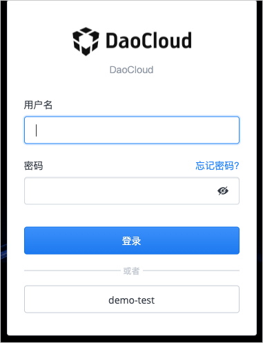
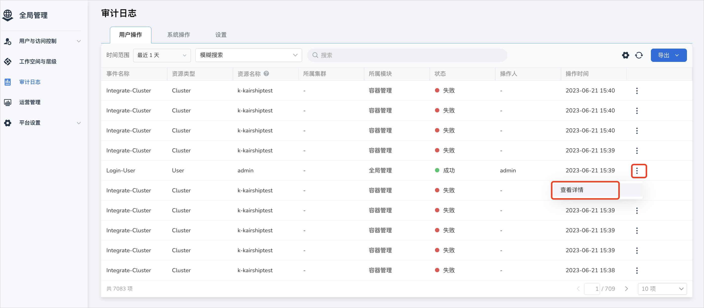
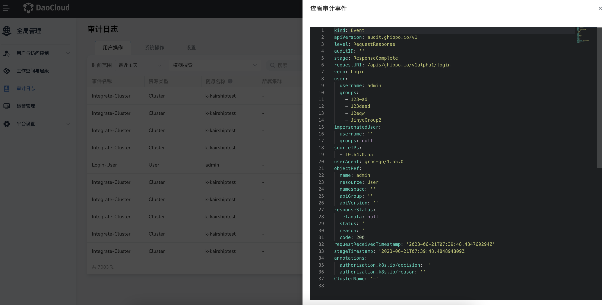
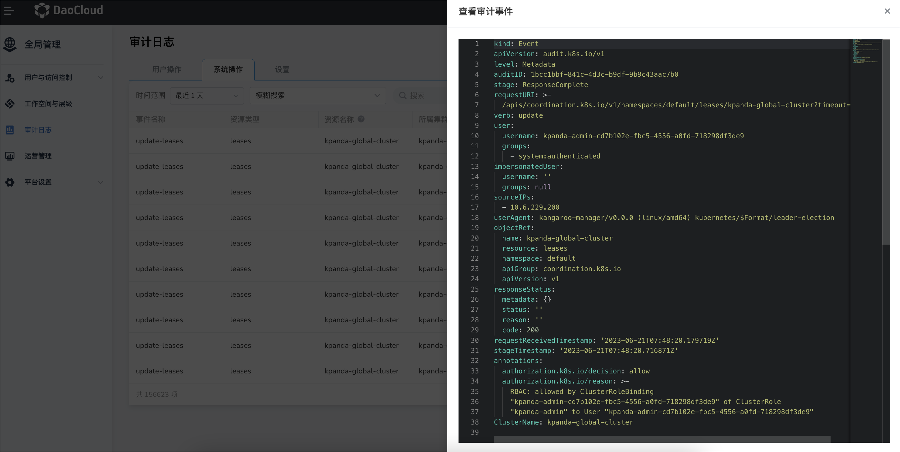
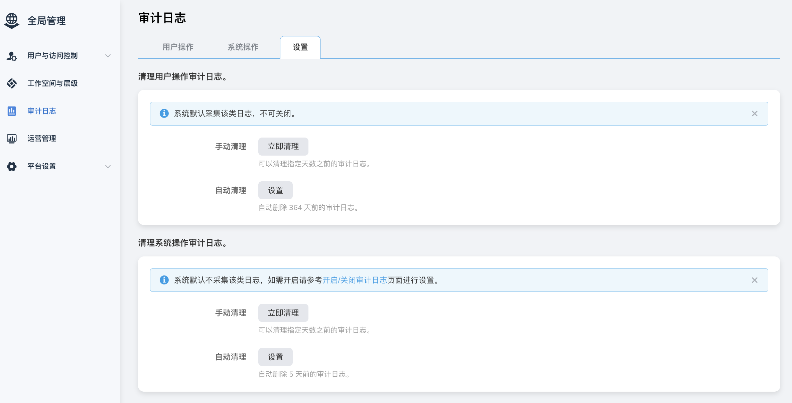

# 审计日志

审计日志帮助您监控并记录每个用户的活动，提供了与安全相关的、按时间顺序排列的记录的收集、存储和查询功能。
借助审计日志服务，您可以持续监控并保留用户在全局管理模块的使用行为，包括但不限于创建用户、用户登录/登出、用户授权以及与 Kubernetes 相关的用户操作行为。

## 功能特性

审计日志功能具有以下特点：

- 开箱即用：在安装使用该平台时，审计日志功能将会被默认启用，自动记录与用户相关的各种行为，
  如创建用户、授权、登录/登出等。默认可以在平台内查看 365 天的用户行为。
- 安全分析：审计日志会对用户操作进行详细的记录并提供导出功能，通过这些事件您可以判断账号是否存在风险。
- 实时记录：迅速收集操作事件，用户操作后可在审计日志列表进行追溯，随时发现可疑行为。
- 方便可靠：审计日志支持手动清理和自动清理两种方式，可根据您的存储大小配置清理策略。

## 查看审计日志

1. 使用具有 __admin__ 或 __Audit Owner__ 角色的用户登录 DCE 5.0。

    

2. 在左侧导航栏底部，点击 __全局管理__ -> __审计日志__ 。

    

## 用户操作

在 __用户操作__ 页签中，可以按时间范围，也可以通过模糊搜索、精确搜索来查找用户操作事件。

点击某个事件最右侧的 __┇__ ，可以查看事件详情。

事件详情如下图所示。

点击右上角的 __导出__ 按钮，可以按 CSV 和 Excel 格式导出当前所选时间范围内的用户操作日志。

## 系统操作

在 __系统操作__ 页签中，可以按时间范围，也可以通过模糊搜索、精确搜索来查找系统操作事件。

同样点击某个事件最右侧的 __┇__ ，可以查看事件详情。

点击右上角的 __导出__ 按钮，可以按 CSV 和 Excel 格式导出当前所选时间范围内的系统操作日志。

## 设置

在 __设置__ 页签中，您可以清理用户操作和系统操作的审计日志。

可以手动清理，建议清理前先导出并保存。也可以设置日志的最长保存时间实现自动清理。

!!! note

    审计日志中与 Kubernetes 相关的日志记录由可观测性模块提供，为减轻审计日志的存储压力，全局管理默认不采集 Kubernetes 相关日志。
    如需记录请参阅开启 [K8s 审计日志](./open-k8s-audit.md)。开启后的清理功能与全局管理的清理功能一致，但互不影响。
