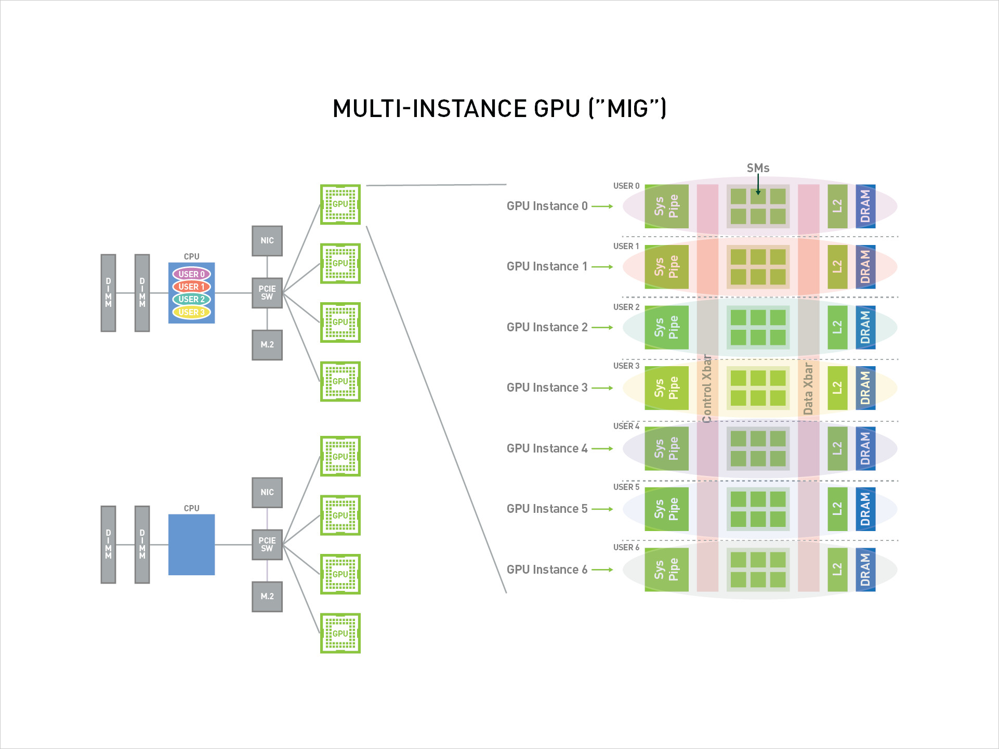
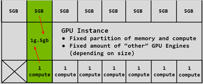

# NVIDIA 多实例 GPU(MIG) 概述

##  MIG 场景

- **多租户云环境**

    MIG 允许云服务提供商将一块物理 GPU 划分为多个独立的 GPU 实例，每个实例可以独立分配给不同的租户。这样可以实现资源的隔离和独立性，满足多个租户对 GPU 计算能力的需求。

- **容器化应用程序**

    MIG 可以在容器化环境中实现更细粒度的 GPU 资源管理。通过将物理 GPU 划分为多个 MIG 实例，可以为每个容器分配独立的 GPU 计算资源，提供更好的性能隔离和资源利用。

- **批处理作业**

    对于需要大规模并行计算的批处理作业，MIG 可以提供更高的计算性能和更大的显存容量。每个 MIG 实例可以利用物理 GPU 的一部分计算资源，从而加速大规模计算任务的处理。

- **AI/机器学习训练**

    MIG 可以在训练大规模深度学习模型时提供更大的计算能力和显存容量。将物理 GPU 划分为多个 MIG 实例，每个实例可以独立进行模型训练，提高训练效率和吞吐量。

总体而言，NVIDIA MIG 适用于需要更细粒度的GPU资源分配和管理的场景，可以实现资源的隔离、提高性能利用率，并且满足多个用户或应用程序对 GPU 计算能力的需求。

## MIG 概述

NVIDIA 多实例 GPU（Multi-Instance GPU，简称 MIG）是 NVIDIA 在 H100，A100，A30 系列 GPU 卡上推出的一项新特性，
旨在将一块物理 GPU 分割为多个 GPU 实例，以提供更细粒度的资源共享和隔离。MIG 最多可将一块 GPU 划分成七个 GPU 实例，
使得一个 物理 GPU 卡可为多个用户提供单独的 GPU 资源，以实现最佳 GPU 利用率。

这个功能使得多个应用程序或用户可以同时共享GPU资源，提高了计算资源的利用率，并增加了系统的可扩展性。

通过 MIG，每个 GPU 实例的处理器在整个内存系统中具有独立且隔离的路径——芯片上的交叉开关端口、L2
高速缓存组、内存控制器和 DRAM 地址总线都唯一分配给单个实例。

这确保了单个用户的工作负载能够以可预测的吞吐量和延迟运行，并具有相同的二级缓存分配和 DRAM 带宽。
MIG 可以划分可用的 GPU 计算资源（包括流多处理器或 SM 和 GPU 引擎，如复制引擎或解码器）进行分区，
以便为不同的客户端（如虚拟机、容器或进程）提供定义的服务质量（QoS）和故障隔离）。
MIG 使多个 GPU 实例能够在单个物理 GPU 上并行运行。

MIG 允许多个 vGPU（以及虚拟机）在单个 GPU 实例上并行运行，同时保留 vGPU 提供的隔离保证。
有关使用 vGPU 和 MIG 进行 GPU 分区的详细信息，请参阅
[NVIDIA Multi-Instance GPU and NVIDIA Virtual Compute Server](https://www.nvidia.com/content/dam/en-zz/Solutions/design-visualization/solutions/resources/documents1/TB-10226-001_v01.pdf)。

## MIG 架构

如下是一个 MIG 的概述图，可以看出 MIG 将一张物理 GPU 卡虚拟化成了 7 个 GPU 实例，这些 GPU 实例能够可以被多个 User 使用。

## 重要概念

* __SM__ ：流式多处理器（Streaming Multiprocessor），GPU 的核心计算单元，负责执行图形渲染和通用计算任务。
  每个 SM 包含一组 CUDA 核心，以及共享内存、寄存器文件和其他资源，可以同时执行多个线程。
  每个 MIG 实例都拥有一定数量的 SM 和其他相关资源，以及被划分出来的显存。
* __GPU Memory Slice__ ：GPU 内存切片，GPU 内存切片是 GPU 内存的最小部分，包括相应的内存控制器和缓存。
  GPU 内存切片大约是 GPU 内存资源总量的八分之一，包括容量和带宽。
* __GPU SM Slice__ ：GPU SM 切片是 GPU 上 SM 的最小计算单位。在 MIG 模式下配置时，
  GPU SM 切片大约是 GPU 中可用 SMS 总数的七分之一。
* __GPU Slice__ ：GPU 切片是 GPU 中由单个 GPU 内存切片和单个 GPU SM 切片组合在一起的最小部分。
* __GPU Instance__ ：GPU 实例 （GI） 是 GPU 切片和 GPU 引擎（DMA、NVDEC 等）的组合。
  GPU 实例中的任何内容始终共享所有 GPU 内存切片和其他 GPU 引擎，但它的 SM 切片可以进一步细分为计算实例（CI）。
  GPU 实例提供内存 QoS。每个 GPU 切片都包含专用的 GPU 内存资源，这些资源会限制可用容量和带宽，并提供内存 QoS。
  每个 GPU 内存切片获得总 GPU 内存资源的八分之一，每个 GPU SM 切片获得 SM 总数的七分之一。
* __Compute Instance__ ：GPU 实例的计算切片可以进一步细分为多个计算实例 （CI），其中 CI 共享父
  GI 的引擎和内存，但每个 CI 都有专用的 SM 资源。

### GPU 实例（GI）

本节介绍如何在 GPU 上创建各种分区。将使用 A100-40GB 作为示例演示如何对单个 GPU 物理卡上进行分区。

GPU 的分区是使用内存切片进行的，因此可以认为 A100-40GB GPU 具有 8x5GB 内存切片和 7 个 GPU SM 切片，如下图所示，展示了 A100 上可用的内存切片。

如上所述，创建 GPU 实例 （GI） 需要将一定数量的内存切片与一定数量的计算切片相结合。
在下图中，一个 5GB 内存切片与 1 个计算切片相结合，以创建 __1g.5gb__ GI 配置文件：

同样，4x5GB 内存切片可以与 4x1 计算切片结合使用以创建 __4g.20gb__ 的 GI 配置文件：

### 计算实例（CI）

GPU 实例的计算切片(GI)可以进一步细分为多个计算实例（CI），其中 CI 共享父 GI 的引擎和内存，
但每个 CI 都有专用的 SM 资源。使用上面的相同 __4g.20gb__ 示例，可以创建一个 CI 以仅使用第一个计算切片的 __1c.4g.20gb__ 计算配置，如下图蓝色部分所示：

在这种情况下，可以通过选择任何计算切片来创建 4 个不同的 CI。还可以将两个计算切片组合在一起以创建 __2c.4g.20gb__ 的计算配置）：

除此之外，还可以组合 3 个计算切片以创建计算配置文件，或者可以组合所有 4 个计算切片以创建 __3c.4g.20gb__ 、 __4c.4g.20gb__ 计算配置文件。
合并所有 4 个计算切片时，配置文件简称为 __4g.20gb__ 。
