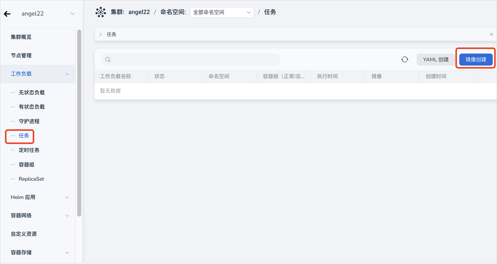
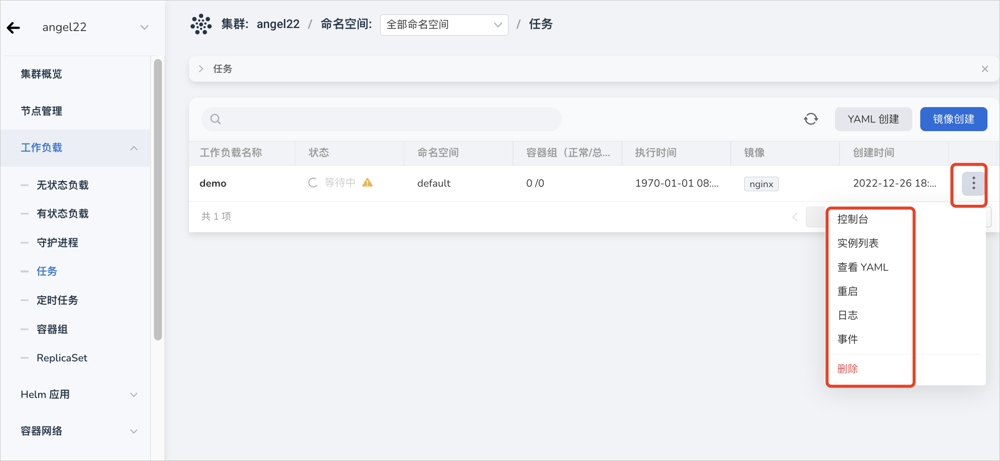
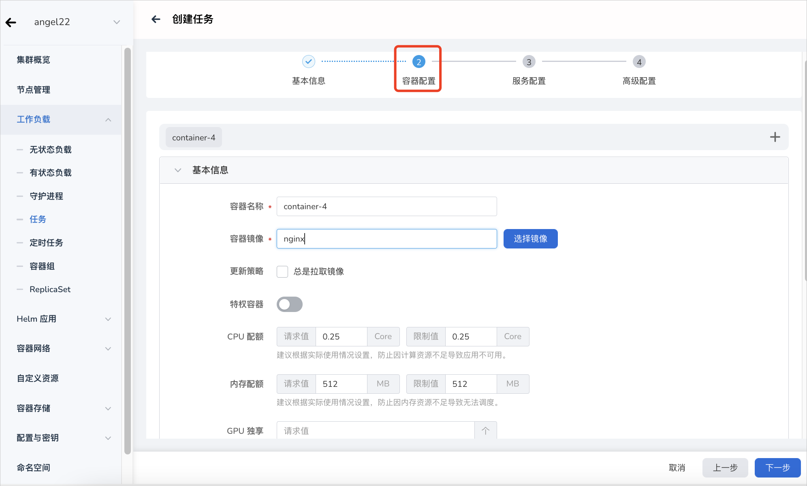
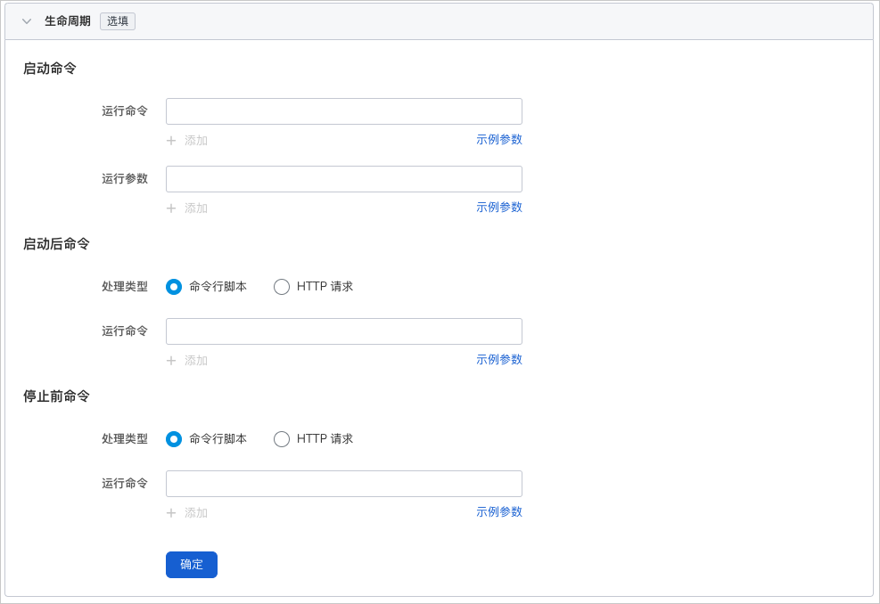
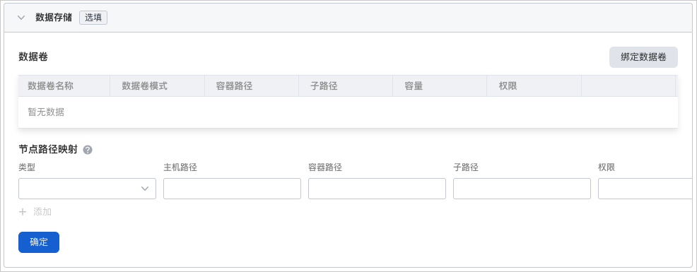
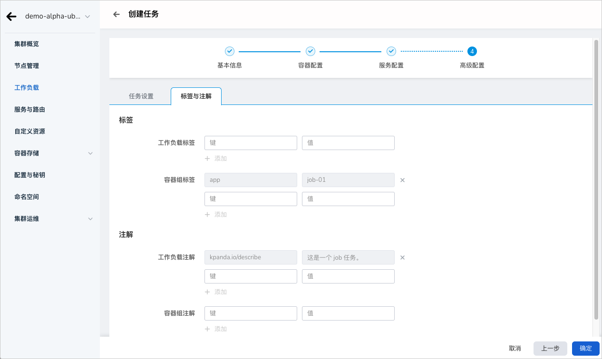
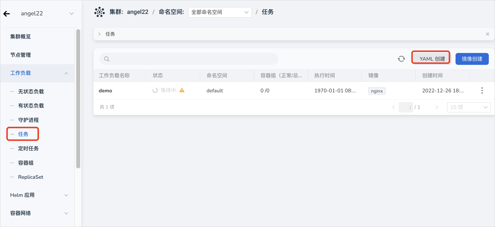
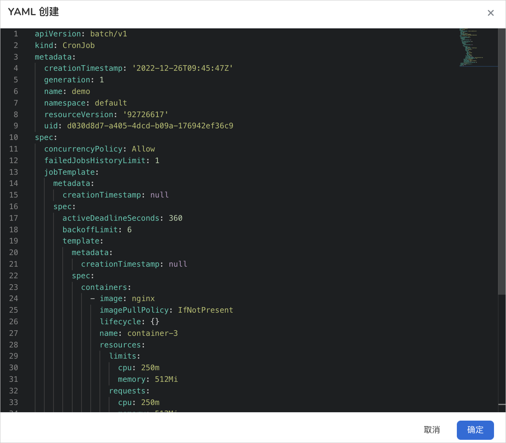

# 创建任务（Job）

本文介绍如何通过镜像和 YAML 文件两种方式创建任务（Job）。

任务（Job）适用于执行一次性任务。Job 会创建一个或多个 Pod，Job 会一直重新尝试执行 Pod，直到成功终止的 Pod 达到一定数量。成功终止的 Pod 达到指定的数量后，Job 也随之结束。删除 Job 时会一同清除该 Job 创建的所有 Pod。暂停 Job 时删除该 Job 中的所有活跃 Pod，直到 Job 被继续执行。有关任务（Job）的更多介绍，可参考[Job](https://kubernetes.io/zh-cn/docs/concepts/workloads/controllers/job/)。

## 前提条件

- 在容器管理模块中[接入 Kubernetes 集群](../clusters/integrate-cluster.md)或者[创建 Kubernetes 集群](../clusters/create-cluster.md)，且能够访问集群的 UI 界面。

- 创建一个[命名空间](../namespaces/createns.md)和[用户](../../../ghippo/user-guide/access-control/user.md)。

- 当前操作用户应具有 [NS Editor](../permissions/permission-brief.md#ns-editor) 或更高权限，详情可参考[命名空间授权](../namespaces/createns.md)。

- 单个实例中有多个容器时，请确保容器使用的端口不冲突，否则部署会失效。

## 镜像创建

参考以下步骤，使用镜像创建一个任务。

1. 点击左侧导航栏上的 __集群列表__ ，然后点击目标集群的名称，进入 __集群详情__ 页面。

    

2. 在集群详情页面，点击左侧导航栏的 __工作负载__ -> __任务__ ，然后点击页面右上角的 __镜像创建__ 按钮。

    

3. 依次填写[基本信息](create-job.md#_3)、[容器配置](create-job.md#_4)、服务配置、[高级配置](create-job.md#_5)后，在页面右下角点击 __确定__ 完成创建。

    系统将自动返回 __任务__ 列表。点击列表右侧的 __┇__ ，可以对任务执行执行更新、删除、重启等操作。

    

### 基本信息

在 __创建任务__ 页面中，根据下表输入基本信息后，点击 __下一步__ 。


- 负载名称：最多包含 63 个字符，只能包含小写字母、数字及分隔符（“-”），且必须以小写字母或数字开头及结尾。同一命名空间内同一类型工作负载的名称不得重复，而且负载名称在工作负载创建好之后不可更改。
- 命名空间：选择将新建的任务部署在哪个命名空间，默认使用 default 命名空间。找不到所需的命名空间时可以根据页面提示去[创建新的命名空间](../namespaces/createns.md)。
- 实例数：输入工作负载的 Pod 实例数量。默认创建 1 个 Pod 实例。
- 描述：输入工作负载的描述信息，内容自定义。字符数量应不超过 512 个。

### 容器配置

容器配置分为基本信息、生命周期、健康检查、环境变量、数据存储、安全设置六部分，点击下方的相应页签可查看各部分的配置要求。

> 容器配置仅针对单个容器进行配置，如需在一个容器组中添加多个容器，可点击右侧的 __+__ 添加多个容器。

=== "基本信息（必填）"

    在配置容器相关参数时，必须正确填写容器的名称、镜像参数，否则将无法进入下一步。参考以下要求填写配置后，点击 __确认__ 。

    
    
    - 容器类型：默认为`工作容器`。有关初始化容器，参见 [k8s 官方文档](https://kubernetes.io/zh-cn/docs/concepts/workloads/pods/init-containers/)。
    - 容器名称：最多包含 63 个字符，支持小写字母、数字及分隔符（“-”）。必须以小写字母或数字开头及结尾，例如 nginx-01。
    - 镜像：
        - 容器镜像：从列表中选择一个合适的镜像。输入镜像名称时，默认从官方的 [DockerHub](https://hub.docker.com/) 拉取镜像。
          接入算丰 AI 算力平台的镜像仓库模块后，可以点击右侧的 __选择镜像__ 按钮来选择镜像。
        - 镜像版本：从下拉列表选择一个合适的版本。
        - 镜像拉取策略：勾选 __总是拉取镜像__ 后，负载每次重启/升级时都会从仓库重新拉取镜像。
          如果不勾选，则只拉取本地镜像，只有当镜像在本地不存在时才从镜像仓库重新拉取。
          更多详情可参考[镜像拉取策略](https://kubernetes.io/zh-cn/docs/concepts/containers/images/#image-pull-policy)。
        - 镜像仓库密钥：可选。如果目标仓库需要 Secret 才能访问，需要先去[创建一个密钥](../configmaps-secrets/create-secret.md)。
    - 特权容器：容器默认不可以访问宿主机上的任何设备，开启特权容器后，容器即可访问宿主机上的所有设备，享有宿主机上的运行进程的所有权限。
    - CPU/内存配额：CPU/内存资源的请求值（需要使用的最小资源）和限制值（允许使用的最大资源）。请根据需要为容器配置资源，避免资源浪费和因容器资源超额导致系统故障。默认值如图所示。
    - GPU 配置：为容器配置 GPU 用量， 仅支持输入正整数。
        - 整卡模式：
            - 物理卡数量：容器能够使用的物理 GPU 卡数量。配置后，容器将占用整张物理 GPU卡。同时物理卡数量需要 ≤ 单节点插入的最大 GPU 卡数。
        - 虚拟化模式：
            - 物理卡数量：容器能够使用的物理 GPU 卡数量， 物理卡数量需要 ≤ 单节点插入的最大 GPU 卡数。
            - GPU 算力：每张物理 GPU 卡上需要使用的算力百分比，最多为100%。
            - 显存：每张物理卡上需要使用的显存数量。
            - 调度策略（Binpack / Spread）：支持基于 GPU 卡和基于节点的两种维度的调度策略。Binpack 是集中式调度策略，优先将容器调度到同一个节点的同一张 GPU 卡上；Spread 是分散式调度策略，优先将容器调度到不同节点的不同 GPU 卡上，根据实际场景可组合使用。（当工作负载级别的 Binpack / Spread 调度策略与集群级别的 Binpack / Spread 调度策略冲突时，系统优先使用工作负载级别的调度策略）。
            - 任务优先级：GPU 算力会优先供给高优先级任务使用，普通任务会减少甚至暂停使用 GPU 算力，直到高优先级任务结束，普通任务会重新继续使用 GPU 算力，常用于在离线混部场景。
            - 指定型号：将工作负载调度到指定型号的 GPU 卡上，适用于对 GPU 型号有特殊要求的场景。
        - Mig 模式
            - 规格：切分后的物理 GPU 卡规格。
            - 数量：使用该规格的数量。
    
    > 设置 GPU 之前，需要管理员预先在集群上安装 [GPU Operator](../gpu/nvidia/install_nvidia_driver_of_operator.md) 和 [nvidia-vgpu](../gpu/nvidia/vgpu/vgpu_addon.md)（仅 vGPU 模式需要安装），并在[集群设置](../clusterops/cluster-settings.md)中开启 GPU 特性。

=== "生命周期（选填）"

    设置容器启动时、启动后、停止前需要执行的命令。详情可参考[容器生命周期配置](pod-config/lifecycle.md)。

    

=== "健康检查（选填）"

    用于判断容器和应用的健康状态，有助于提高应用的可用性。详情可参考[容器健康检查配置](pod-config/health-check.md)。

    

=== "环境变量（选填）"

    配置 Pod 内的容器参数，为 Pod 添加环境变量或传递配置等。详情可参考[容器环境变量配置](pod-config/env-variables.md)。

    

=== "数据存储（选填）"

    配置容器挂载数据卷和数据持久化的设置。详情可参考[容器数据存储配置](pod-config/env-variables.md)。

    

=== "安全设置（选填）"

    通过 Linux 内置的账号权限隔离机制来对容器进行安全隔离。您可以通过使用不同权限的账号 UID（数字身份标记）来限制容器的权限。例如，输入 __0__ 表示使用 root 账号的权限。

    

### 高级配置

高级配置包括任务设置、标签与注解两部分。

=== "任务设置"

    

    - 并行数：任务执行过程中允许同时创建的最大 Pod 数，并行数应不大于 Pod 总数。默认为 1。
    - 超时时间：超出该时间时，任务会被标识为执行失败，任务下的所有 Pod 都会被删除。为空时表示不设置超时时间。
    - 重启策略：设置失败时是否重启 Pod。

=== "标签与注解"

    可以点击 __添加__ 按钮为工作负载实例 Pod 添加标签和注解。

    

## YAML 创建

除了通过镜像方式外，还可以通过 YAML 文件更快速地创建创建任务。

1. 点击左侧导航栏上的 __集群列表__ ，然后点击目标集群的名称，进入 __集群详情__ 页面。

    

2. 在集群详情页面，点击左侧导航栏的 __工作负载__ -> __任务__ ，然后点击页面右上角的 __YAML 创建__ 按钮。

    

3. 输入或粘贴事先准备好的 YAML 文件，点击 __确定__ 即可完成创建。

    

??? note "点击查看创建任务的 YAML 示例"

    ```yaml
    kind: Job
    apiVersion: batch/v1
    metadata:
      name: demo
      namespace: default
      uid: a9708239-0358-4aa1-87d3-a092c080836e
      resourceVersion: '92751876'
      generation: 1
      creationTimestamp: '2022-12-26T10:52:22Z'
      labels:
        app: demo
        controller-uid: a9708239-0358-4aa1-87d3-a092c080836e
        job-name: demo
      annotations:
        revisions: >-
          {"1":{"status":"running","uid":"a9708239-0358-4aa1-87d3-a092c080836e","start-time":"2022-12-26T10:52:22Z","completion-time":"0001-01-01T00:00:00Z"}}
    spec:
      parallelism: 1
      backoffLimit: 6
      selector:
        matchLabels:
          controller-uid: a9708239-0358-4aa1-87d3-a092c080836e
      template:
        metadata:
          creationTimestamp: null
          labels:
            app: demo
            controller-uid: a9708239-0358-4aa1-87d3-a092c080836e
            job-name: demo
        spec:
          containers:
            - name: container-4
              image: nginx
              resources:
                limits:
                  cpu: 250m
                  memory: 512Mi
                requests:
                  cpu: 250m
                  memory: 512Mi
              lifecycle: {}
              terminationMessagePath: /dev/termination-log
              terminationMessagePolicy: File
              imagePullPolicy: IfNotPresent
              securityContext:
                privileged: false
          restartPolicy: Never
          terminationGracePeriodSeconds: 30
          dnsPolicy: ClusterFirst
          securityContext: {}
          schedulerName: default-scheduler
      completionMode: NonIndexed
      suspend: false
    status:
      startTime: '2022-12-26T10:52:22Z'
      active: 1
    ```
